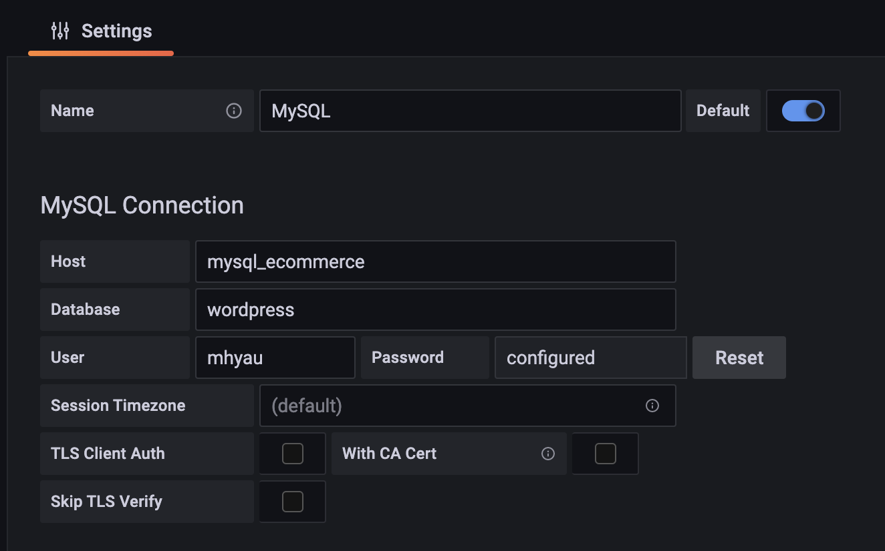
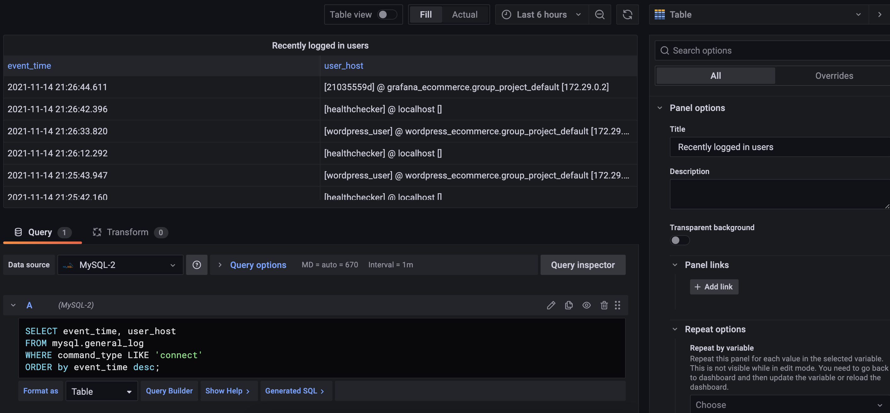
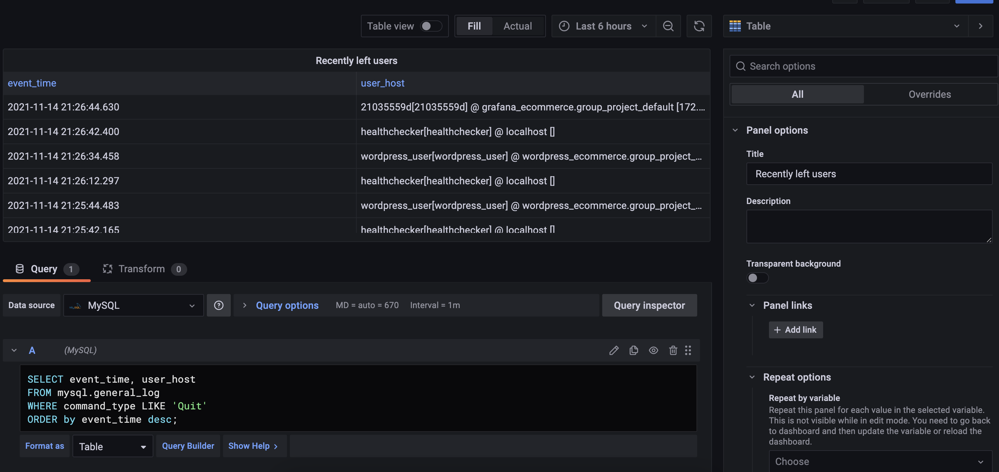
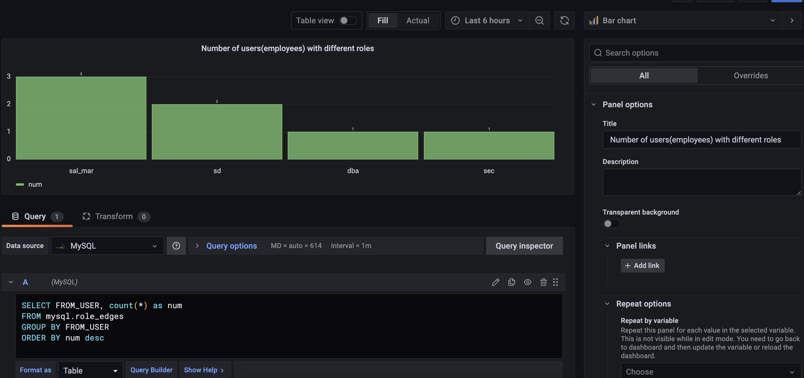
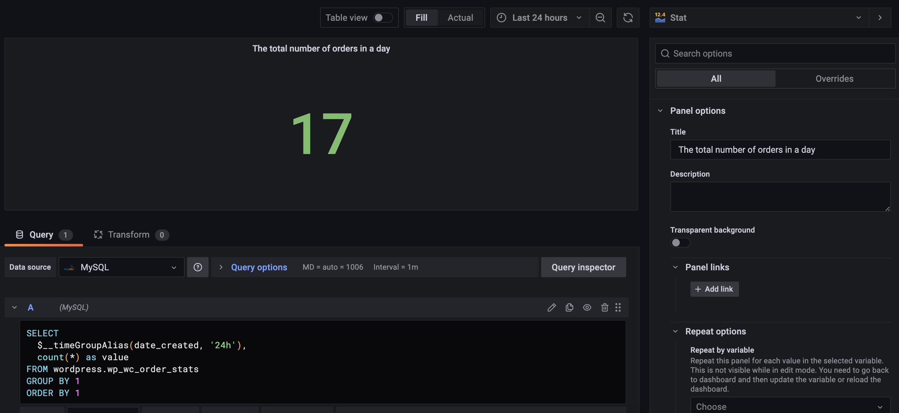
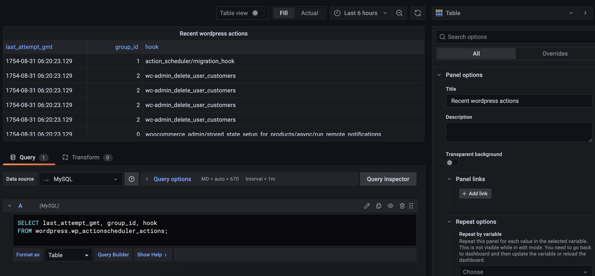
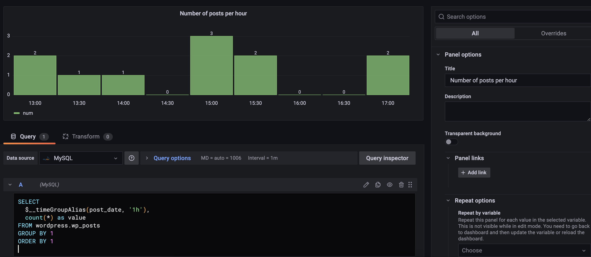
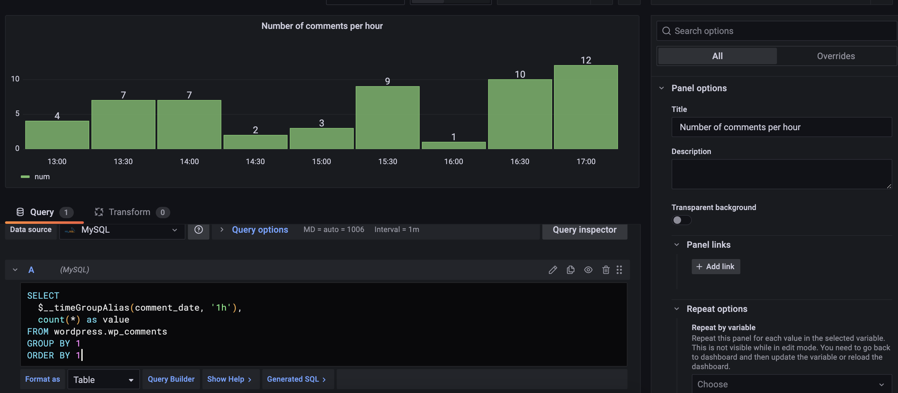

# Create a Grafana auditing
## Login Grafana and link with mysql
1. Open your brower and go to http://127.0.0.1:3000/
2. login with ac:admin, pw:admin
3. Click configuration -> data sources -> choose mysql -> type the information

## Create dashboards
1. Click create -> dashboard -> add an empty panel
2. configure the panels(Like the picture below)

### Recently logged in users(Table)
copy the SQL
<pre class="file">
SELECT event_time, user_host
FROM mysql.general_log
WHERE command_type LIKE 'connect'
ORDER by event_time desc;
</pre>

### Recently left in users(Table)
copy the SQL
<pre class="file">
SELECT event_time, user_host
FROM mysql.general_log
WHERE command_type LIKE 'Quit'
ORDER by event_time desc;
</pre>

### Top 10 most frequently used queries (bar chart horizontal)
copy the SQL
<pre class="file">
SELECT argument, count(*) as num
FROM mysql.general_log
WHERE command_type LIKE "Query"
GROUP BY argument
ORDER by num desc
LIMIT 10;
</pre>

### Number of users(employees) with different roles (bar chart vertical)
copy the SQL
<pre class="file">
SELECT FROM_USER, count(*) as num
FROM mysql.role_edges
GROUP BY FROM_USER
ORDER BY num desc
</pre>

### The total number of orders in a day (stat)
copy the SQL
<pre class="file">
SELECT
  $__timeGroupAlias(date_created, '24h'),
  count(*) as value
FROM wordpress.wp_wc_order_stats
GROUP BY 1
ORDER BY 1
</pre>

### Recent wordpress actions (table)
copy the SQL
<pre class="file">
SELECT last_attempt_gmt, group_id, hook
FROM wordpress.wp_actionscheduler_actions;
</pre>

### Number of posts per hour (time series bar horizontal)
copy the SQL
<pre class="file">
SELECT
  $__timeGroupAlias(post_date, '1h'),
  count(*) as value
FROM wordpress.wp_posts
GROUP BY 1
ORDER BY 1
</pre>

### Number of comments per hour (time series bar horizontal)
copy the SQL
<pre class="file">
SELECT
  $__timeGroupAlias(comment_date, '1h'),
  count(*) as value
FROM wordpress.wp_comments
GROUP BY 1
ORDER BY 1
</pre>

