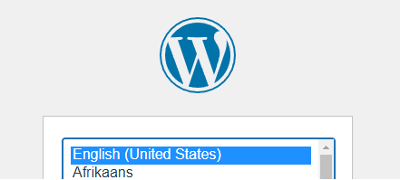
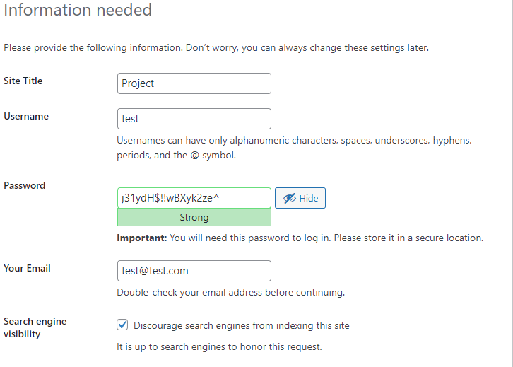
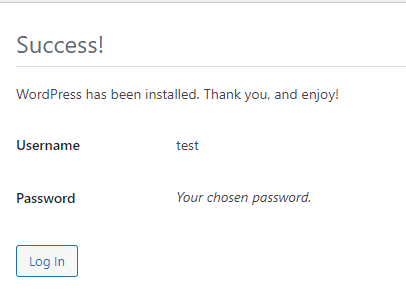
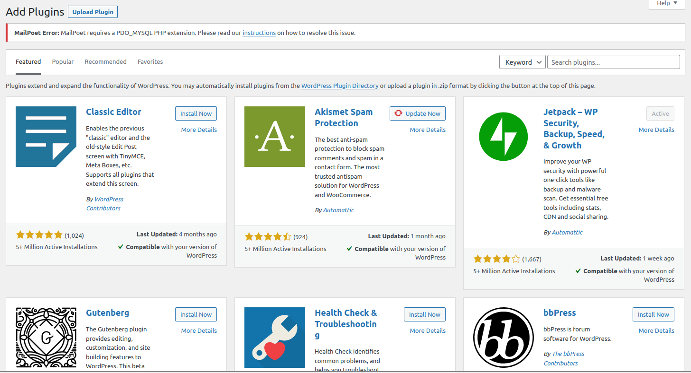

# Step 2 - Customize your WordPress website

Create a simple online e-commerce store by using WordPress plguins.
1. WooCommerce is used for this scenario. It is a open-source eCommerce platform built on WordPress.
2. Some security plugins will be introduced to improve WordPress security. Plugins can be found in https://wordpress.org/plugins/.

## Installation
- Press the dashboard named "Port 20080". It will lead you to WordPress install page.

Pick a language:

- Choose any site title and username(Administrator). About password of the admin, it is recommended to use a strong password.
- WordPress will tell you if your password is strong/weak. It actually uses a library called "zxcvbn" made by Dropbox in 2012.
- It analyzes patterns in the password. For example, "Password54321!" is not a good password. It uses a dictionary word and easily attacked by simple dictionary attack.
  - Further explaination: https://dropbox.tech/security/zxcvbn-realistic-password-strength-estimation
- WordPress default password encryption is a combination of MD5 and PHPass.
- MD5 is not a suitable cryptographic algorithm for storing in a database. Another encryption method will be introduced and recommended after step 2. 

- After inserting the information, Press "Install WordPress" and login to your account you just created.

## Plugins

- Press Add New on the left of the WordPress menu.

- You can add different plugins in this page. Type the name of the plugins in the search bar.

- Type WooCommerce in the search bar and install now.

- Type WebToffee Customer Import Export and install now. WooCommerce already allowed users to import products by csv files. Sammple product csv files can be found
in the internet.

