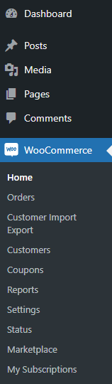
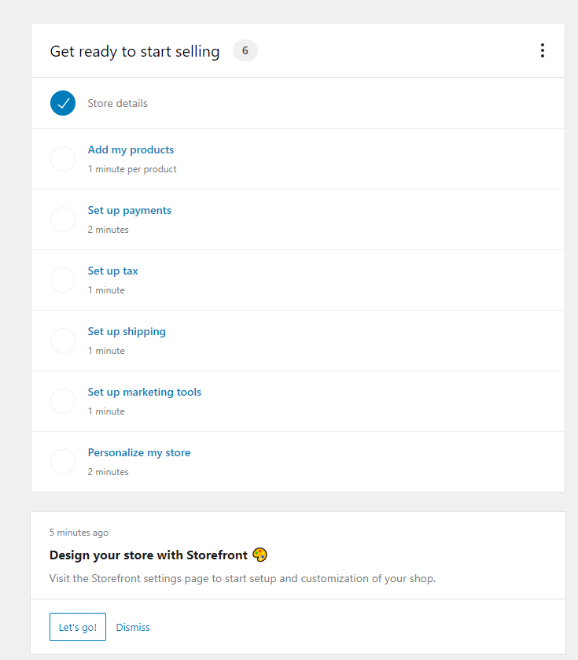
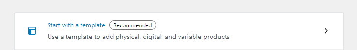
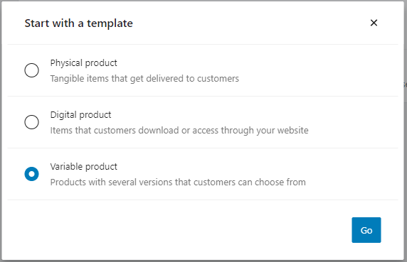
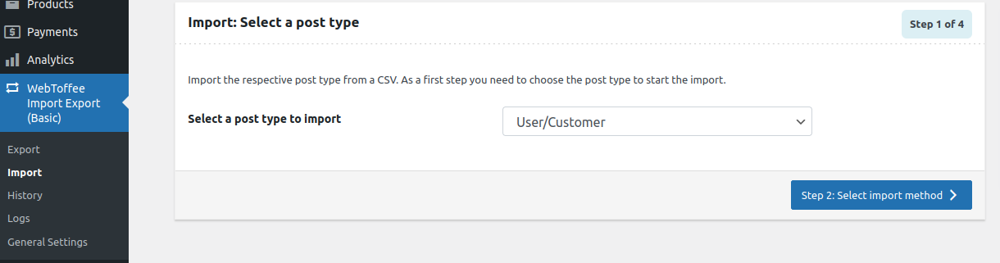
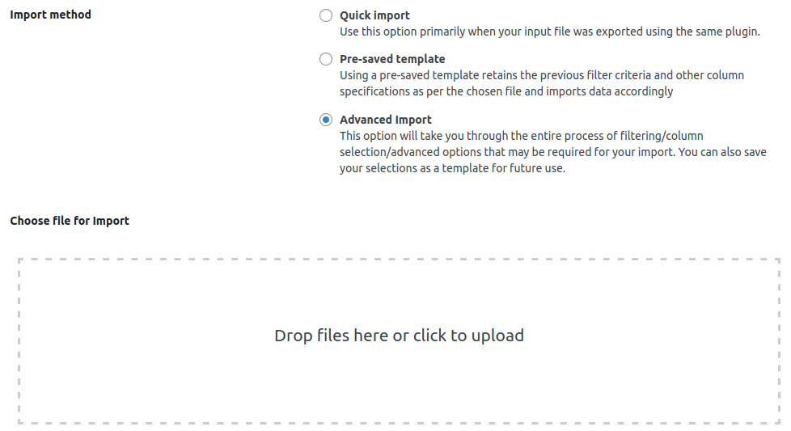

# Step 3 - Import Custom Data

WooCommerce allows you to import and export products by using CSV files, but unfortunately user roles cannot be imported or exported except extra plugins are used
In this scenario, WebToffee plugin(free version) will be used to demonstrate. Free version plugin only allow users to import and export customer or user role.

## Add new product
There is a Add New Product Page in Products. You can add name of product, description of product, regular price, sale price.

You can do the above automatically by using CSV files.

## Preparation
- CSV files are needed. 

- Product sample csv file can be generated. After WooCommerce is successfully installed, you can see in the menu.

Click it and it will lead you to a simple guide on how to get ready to start selling.

Click Add my products to add template generated by WooCommerce. You will see Start with a template Recommended in Add products page.

Template type:

## Further explaination
There are different type of products you can be added in the Add New section in Products page.
- Simple product
- Grouped product
   - Products like electronic devices can be grouped. For example, an IPad could be grouped as its storage can be 256GB, 512GB, which are the variations of the same product.
- External/Affiliate product
   - The metabox will changed. Shipping section will be removed. The Product URl field will be added to lead customers to buy the product.
- Variable product
   - In this scenario, most of the products will be variable. It is because these products have different price, color, sizes etc.
      - They need a different SKU to identify. A SIMPLE product have only one SKU, like a book. There is no other variations.

You can add the following information:

## Product title and description 
- Product name
- Product description

## General section 
- Regular price
- Sale price 
   - schedule from when to when
- Tax status
- Tax class 
## Inventory section 
- Inventory SKU 
  - a unique indentifier for each distinct product and service that can be purchased)
  - You can keep track the inventory.
- Enable Stock Management 
    - must be selected in order to manage it
- Stock quantity 
- Allow backorders 
  - Customers can buy backordered items on a website, but they won't be delivered until they are back in stock.
- Low stock threshold
  - you will be notified by email when the stock number is lower than an amount.
- sold individually 

## Shipping section 
- Weight
- Dimensions
- Shipping class

## Linked product
- Upsells (promote your other products) and cross-sells (related products)
   - you may want your customers to buy, for example: if the customer is viewing tea kettles, you may want to display tea bags.

Example:

## Attributes and variation
- You can assign details to a product, such as Color, Size by adding custom product attribute

Example:

- You can also set the default values. This 2 will be pre-selected.

Example:

## Advanced
- Purchase note 
   - an optional note for customers after they purchase the product.
- Menu order  
- Enable reviews

The above information can be added by a csv file. The sample csv file can be downloaded from woocommerce github. 
You can select fields from your CSV file to map against products fields. 
https://github.com/woocommerce/woocommerce/blob/master/sample-data/sample_products.csv

## Add new users
- Customer example csv file can be downloaded in here:
https://www.dropbox.com/s/2i2bn03mpmx7ldc/customers.csv?dl=0
19 customers in the csv file.
- You can map your custom csv file columes to WordPress MySQL table columes. For example, ID, Customer_ID, User Login etc. 
- The data of your csv file will automatically insert to WordPress wp_users, wp_usermeta table.
- Using plugins to import and export data is recommended. Using MySQL to insert and delete data IN MySQL CLI is not recommended.
- Extra plugins (PHP code) can do the encryption.

Press import

Drag the csv file from the above link

## Further explaination

## Product title and description 
- ID
- customer_id
- user_login, user_pass, user_nicename, user_email, user_url, user_registered
- display_name
- first_name, last_name
- user_status
- roles
- nickname
- description
- rich_editing, syntax_highlighting
- admin_color
- use_ssl
- show_admin_bar_front
- locale
- wp_user_level
- dismissed_wp_pointers
- show_welcome_panel
- session_tokens
- last_update
- billing information and shipping information

