# Step 4 - Improve WordPress Security

WordPress is open-source content management system for people to set up websites, but it may suffer several attacks, such as brute force attacks by attackers. It is necessary to improve WordPress Security. In this scenario, the iThemes Security plugin and Password bcrypt plugin will be used to improve WordPress Security.
# iThemes Security
iThemes Security is a plugin used to secure and protect WordPress.

## Installation and Setting up the iThemes Security plugin
Press Add New on the left of the WordPress menu.

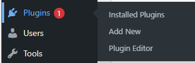

Type iThemes Security in the search bar and click install now.
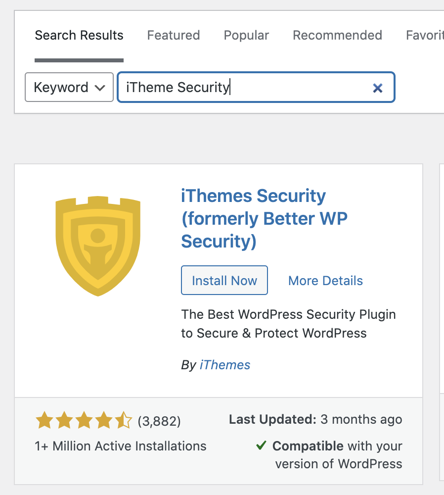

After installation, click Activate.
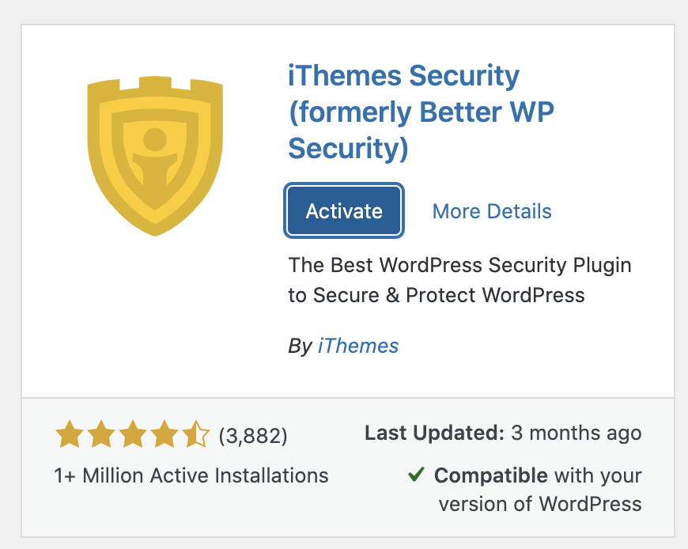

Press Security on the left of the WordPress menu and choose ECOMMERCE type to set up the plugin.
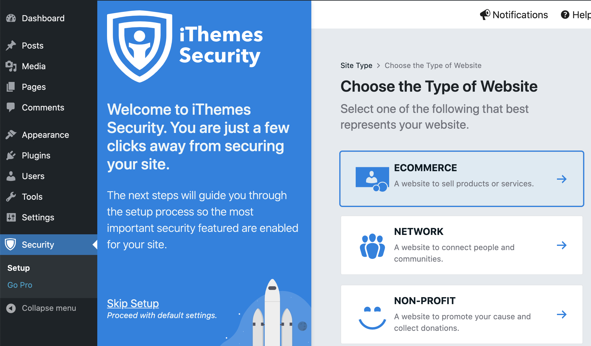

This plugin can force users to use a strong password.

Also, you can enable Two-Factor features to make your WordPress more secure.
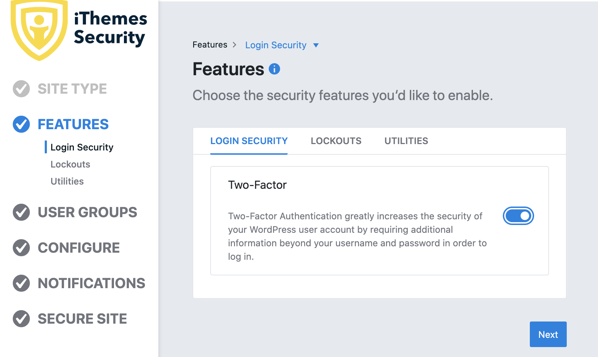

You can configure this plugin based on your preferences.
After configuration, click Secure Site to complete the setup.
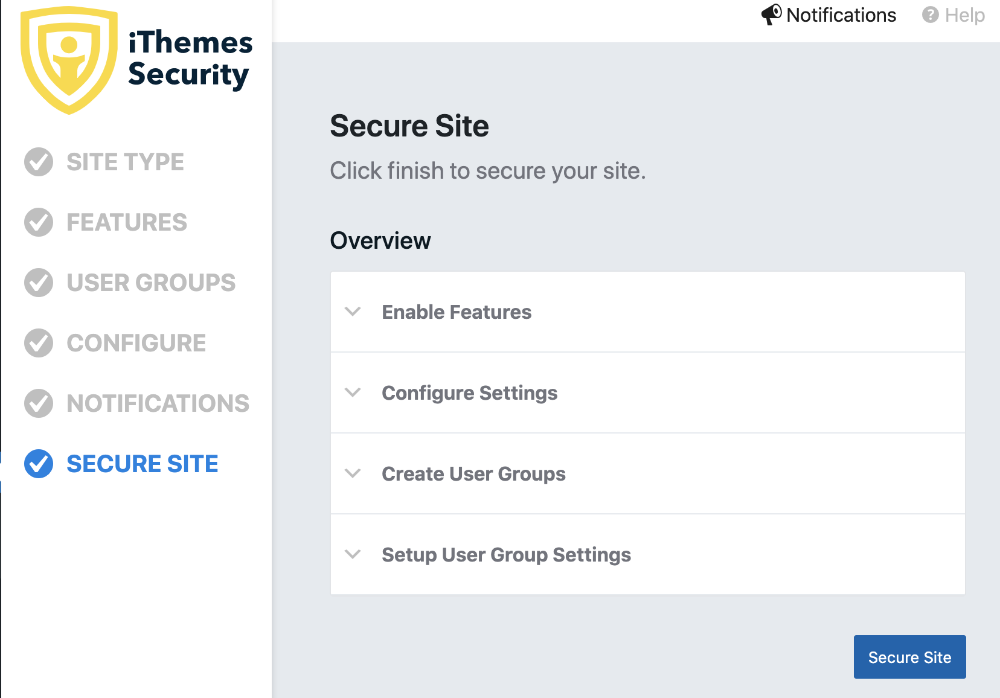

## Verify the itheme Security features
When users try to login to WordPress, user can set up Two-factor to protect their accounts.
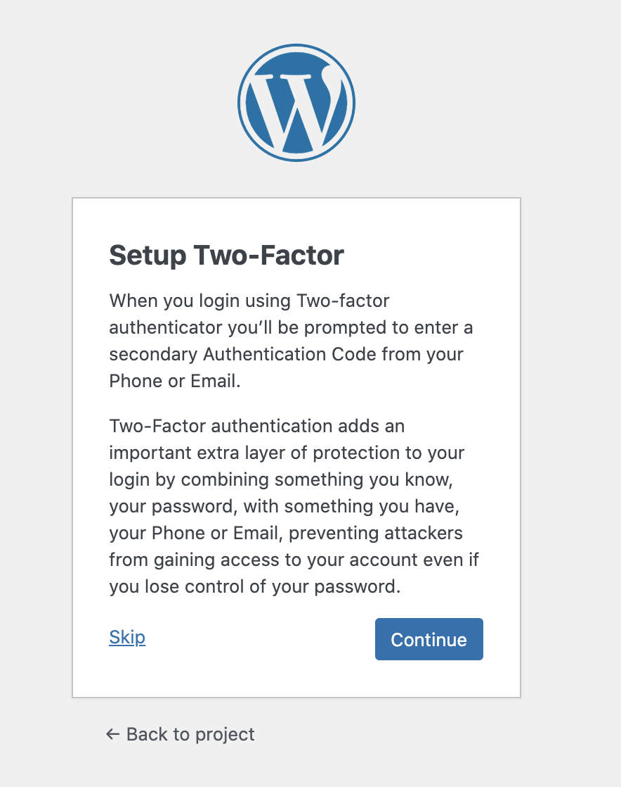

The Two-factor methods include mobile app, email and backup codes.
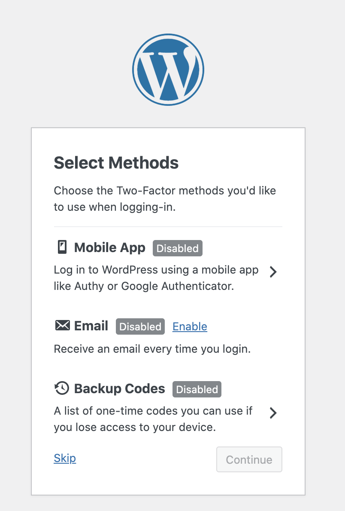

If the user password is weak, It will force the user to change a strong password.
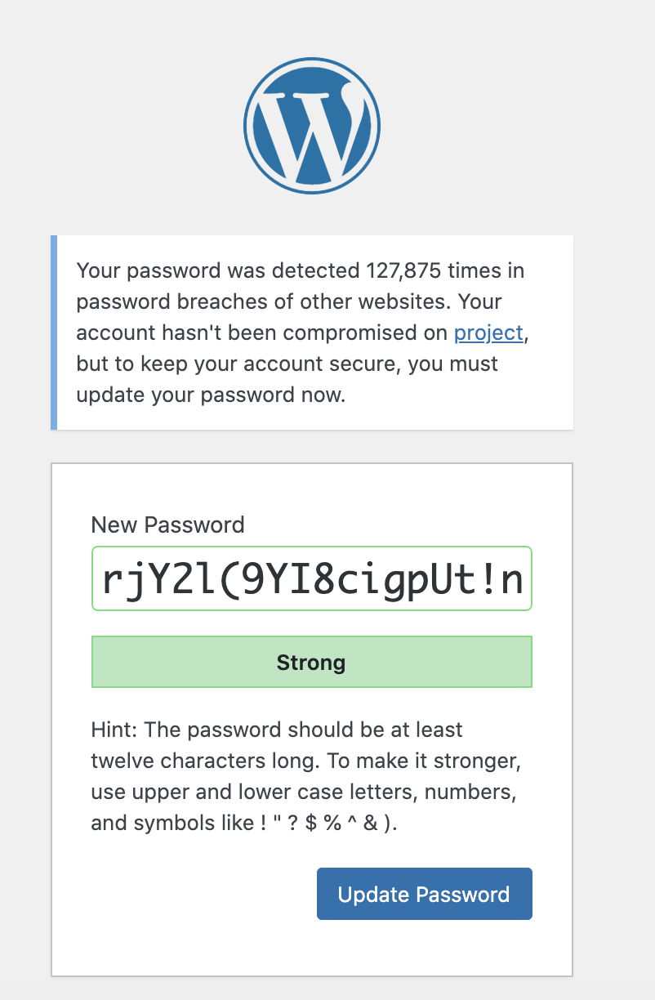

## Prevent Unauthorized Login (Brute force attack)
When an attacker performs brute force attack on your WordPress site, iThemes Security can log it.
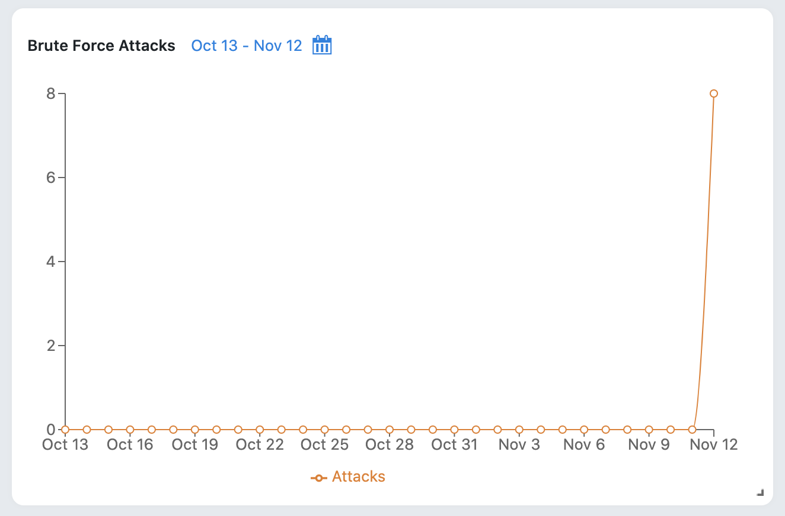

Also, iThemes Security prevents brute force attacks because of two-factor authentication and strong password.
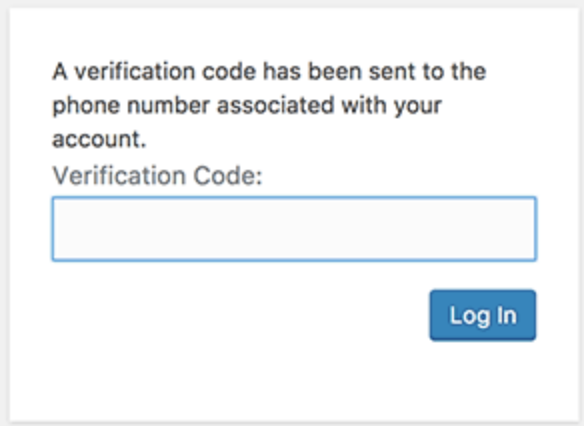

# Password bcrypt
Password bcrypt is WordPress plugin to replace WP's outdated and insecure MD5-based password hashing with the modern and secure bcrypt.

## Installation
Type Password bcrypt in the search bar and click install now.
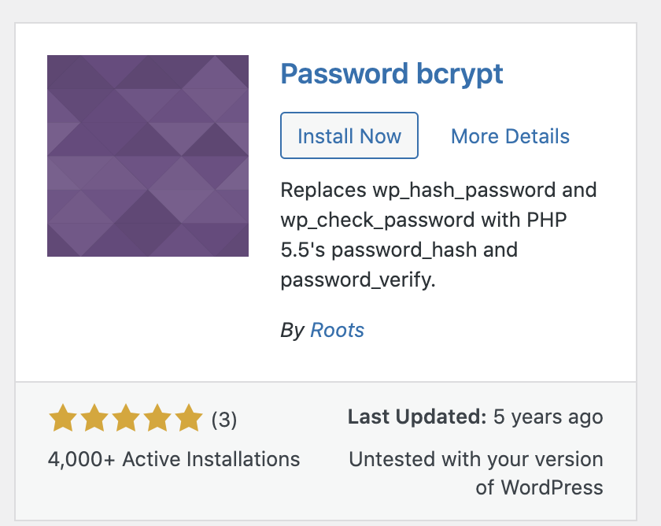

After installation and clicking Activate, the plugin will encrypt the password immediately.
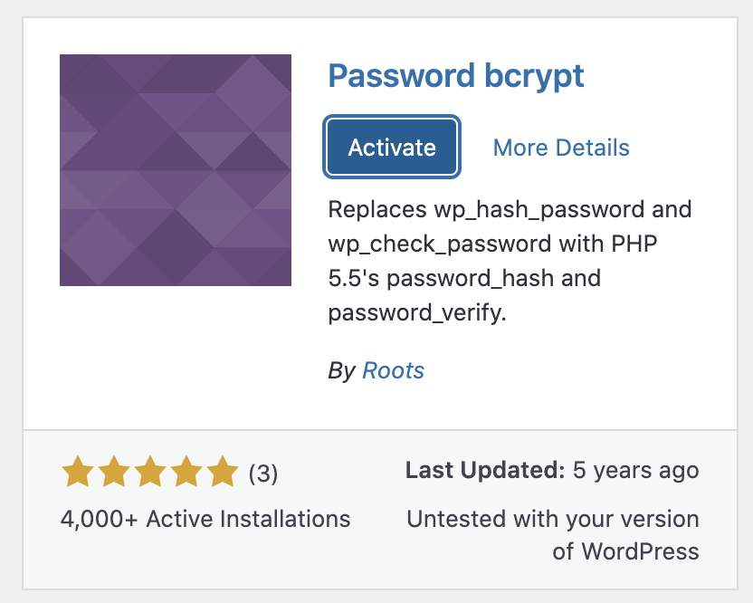
 
Alternatively, download "wp-password-bcrypt.php" file from the plugin's github site.
Create folder "mu-plugins" in wp-content folder and copy the php file downloaded in the folder.
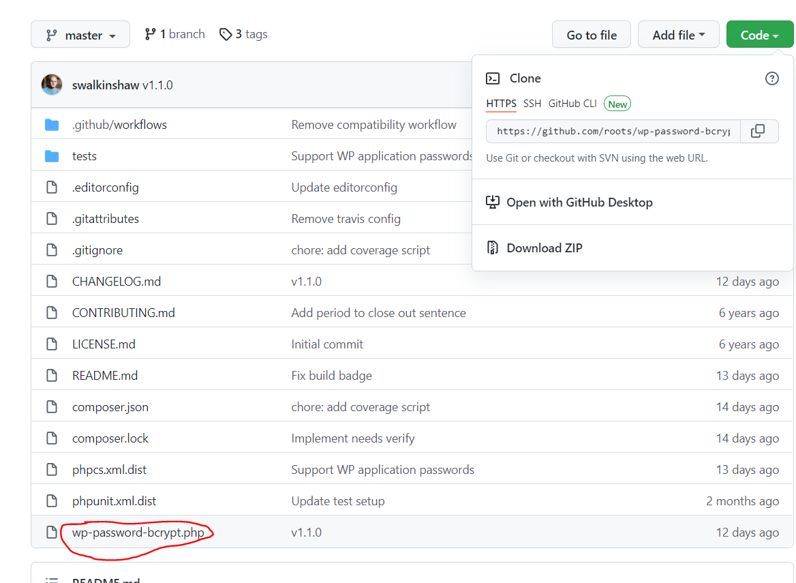

The plugin will becomes must-use plugin in WordPress, which can also encrypt the password.
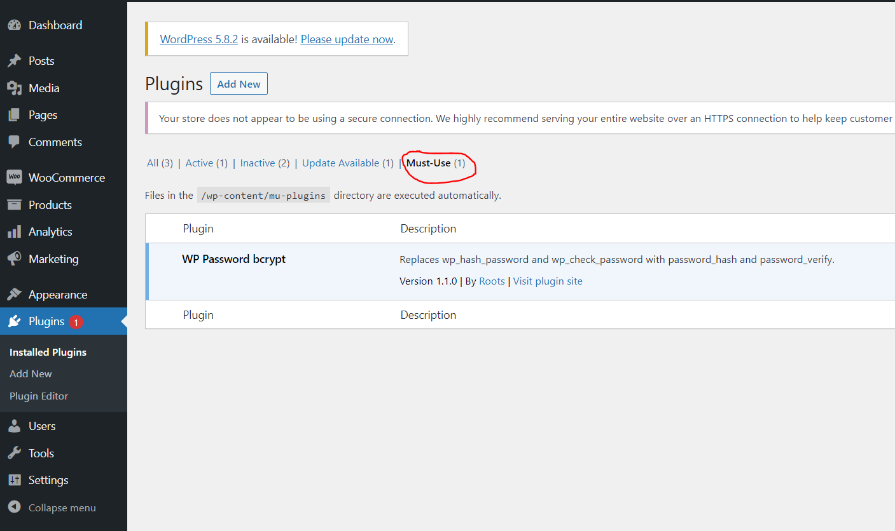
