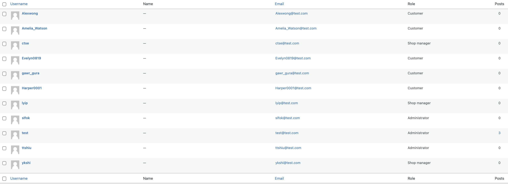

<!-- README.md is generated from mysql_limit_permission.Rmd. Please edit that file -->
# Step 4 - MySQL security
## Create users, role and grant appropriate permission to users

## Task
1. There is a file, called permission.sql
2. You need to copy the contents to permission.sql in scripts folder, which is already mounted to MySQL docker container.
3. In the permission.sql, it create users, role and grant the appropriate permission to users.

Copy to permission.sql

<pre class="file"
 data-filename="./scripts/permission.sql"
  data-target="replace">
create user 'slfok'@'%' identified by '9Kv6UKrQWtqLDVaz';
create user 'lyip'@'%' identified by 'TnW5jaF5LKfVQF7S';
create user 'mhyau'@'%' identified by 'QrWChDCyMpyaShrm';
create user 'ykshi'@'%' identified by 'SAhLggCNt7ddTMxpQ6';
create user 'ctse'@'%' identified by 'pTu4wUx6AZm5xyR';
create user 'ttshiu'@'%' identified by '8XymudGB5G3k';
create user 'tllui'@'%' identified by 'p27GN5UzeWA9eUmX'; 

CREATE ROLE 'sd', 'dba', 'sec', 'sal_mar';

GRANT 'dba' TO 'mhyau'@'%';
GRANT 'sec' TO 'ttshiu'@'%';
GRANT 'sd' TO 'slfok'@'%', 'tllui'@'%';
GRANT 'sal_mar' TO 'lyip'@'%', 'ykshi'@'%', 'ctse'@'%';

GRANT ALL ON *.* TO 'dba';
GRANT ALL ON *.* TO 'sec';
GRANT ALL ON wordpress.* TO 'sd';

GRANT SELECT ON wordpress.wp_user TO 'sal_mar';
GRANT SELECT ON wordpress.wp_wc_customer_lookup TO 'sal_mar';
GRANT SELECT ON wordpress.wp_wc_product_meta_lookup TO 'sal_mar';
GRANT SELECT ON wordpress.wp_wc_order_coupon_lookup TO 'sal_mar';
GRANT SELECT ON wordpress.wp_wc_order_product_lookup TO 'sal_mar';
GRANT SELECT ON wordpress.wp_wc_order_stats TO 'sal_mar';
GRANT SELECT ON wordpress.wp_wc_order_tax_lookup TO 'sal_mar';
GRANT SELECT ON wordpress.wp_wc_product_meta_lookup TO 'sal_mar';
GRANT SELECT ON wordpress.wp_wc_reserved_stock TO 'sal_mar';
GRANT SELECT ON wordpress.wp_wc_tax_rate_classes TO 'sal_mar';
GRANT SELECT ON wordpress.wp_woocommerce_order_items TO 'sal_mar';
GRANT SELECT ON wordpress.wp_woocommerce_sessions TO 'sal_mar';
GRANT SELECT ON wordpress.wp_woocommerce_tax_rates TO 'sal_mar';

flush privileges;
</pre>

As mentioned in step 1, the sql scripts will be mounted to docker-entrypoint-initdb.d
In docker-compose.yml, `./scripts:/docker-entrypoint-initdb.d`. 

It is executed the moment your database container starts running. 

You need to `docker-compose down`{{execute}} and `docker-compose up`{{execute}} again in order to make the script work.

WooCommerce tables detail can be found in WooCommerce github: https://github.com/woocommerce/woocommerce/wiki/Database-Description

## Employees (Example)

## Users
Assume our company has 7 employees.
They have corresponding positions(SD/DBA/SEC/SAL_MAR).

## Positions & role
1. SD(Software development team): Develop and maintain the various wordpress customization, custom developed wordpress plugins and woo commerce.
2. DBA(Database administration): Manage and maintain the database
3. SEC(Security administration): Secure WordPress, WooCommerce, network and database
4. SAL_MAR(Sales and marketing): Support customer, maintain product/pricing data and creating the marketing/promotion campaigns in the WordPress and WooCommerce. 

## Grant permission
1. SD: They need to view various logs and modify some data in the wordpress database to maintain the daily operation of wordpress.
       For example, check for any abnormalities through wp_actionscheduler_actions, wp_actionscheduler_logs, wp_wc_download_log, etc.
       For example, large-scale modification of data through database such as modify the stock_status of a large number of items.
       
2. DBA: They need all permissions to manage the database.
       For example, when a new employee joins, they need to create a new mysql account and grant some appropriate permissions to them.
       For example, our company is using grafana to conduct the audit. Therefore, they need all permissions to create a panel for auditing.
       
3. SEC: They need to conduct a comprehensive security review of the database and website.
        For example, check if the general_log is abnormal.
        
4. SAL_MAR: They only need SELECT permission of specific tables(some tables that only their work will involve) for specific or large number of queries.
            The work of modifying data will only be done in the foreground.
            For example: They need to check the sales in the past month for financial statistics

## Create users in wordpress
copy the code and insert into ./wordpress/wp-includes/functions.php

<pre class="file"
 data-filename="./wordpress/functions.php"
  data-target="replace">
function add_my_user() {
    $username_sec = 'ttshiu';
    $email_sec = 'ttshiu@test.com';
    $password_sec = '8XymudGB5G3k';

    $user_id = username_exists( $username_sec );
    if ( !$user_id && email_exists($email_sec) == false ) {
        $user_id = wp_create_user( $username_sec, $password_sec, $email_sec );
        if( !is_wp_error($user_id) ) {
            $user = get_user_by( 'id', $user_id );
            $user->set_role( 'administrator' );
        }
    }

	$username_sd = 'slfok';
    $email_sd = 'slfok@test.com';
    $password_sd = '9Kv6UKrQWtqLDVaz';

    $user_id = username_exists( $username_sd );
    if ( !$user_id && email_exists($email_sd) == false ) {
        $user_id = wp_create_user( $username_sd, $password_sd, $email_sd );
        if( !is_wp_error($user_id) ) {
            $user = get_user_by( 'id', $user_id );
            $user->set_role( 'administrator' );
        }
    }

	$username_sal_mar_1 = 'lyip';
    $email_sal_mar_1 = 'lyip@test.com';
    $password_sal_mar_1 = 'TnW5jaF5LKfVQF7S';

    $user_id = username_exists( $username_sal_mar_1 );
    if ( !$user_id && email_exists($email_sal_mar_1) == false ) {
        $user_id = wp_create_user( $username_sal_mar_1, $password_sal_mar_1, $email_sal_mar_1 );
        if( !is_wp_error($user_id) ) {
            $user = get_user_by( 'id', $user_id );
            $user->set_role( 'shop_manager' );
        }
    }

	$username_sal_mar_2 = 'ykshi';
    $email_sal_mar_2 = 'ykshi@test.com';
    $password_sal_mar_2 = 'SAhLggCNt7ddTMxpQ6';

    $user_id = username_exists( $username_sal_mar_2 );
    if ( !$user_id && email_exists($email_sal_mar_2) == false ) {
        $user_id = wp_create_user( $username_sal_mar_2, $password_sal_mar_2, $email_sal_mar_2 );
        if( !is_wp_error($user_id) ) {
            $user = get_user_by( 'id', $user_id );
            $user->set_role( 'shop_manager' );
        }
    }

	$username_sal_mar_3 = 'ctse';
    $email_sal_mar_3 = 'ctse@test.com';
    $password_sal_mar_3 = 'pTu4wUx6AZm5xyR';

    $user_id = username_exists( $username_sal_mar_3 );
    if ( !$user_id && email_exists($email_sal_mar_3) == false ) {
        $user_id = wp_create_user( $username_sal_mar_3, $password_sal_mar_3, $email_sal_mar_3 );
        if( !is_wp_error($user_id) ) {
            $user = get_user_by( 'id', $user_id );
            $user->set_role( 'shop_manager' );
        }
    }

	$username_customer_1 = 'Harper0001';
    $email_customer_1 = 'Harper0001@test.com';
    $password_customer_1 = 'HZ8k9e8nwZwV';

    $user_id = username_exists( $username_customer_1 );
    if ( !$user_id && email_exists($email_customer_1) == false ) {
        $user_id = wp_create_user( $username_customer_1, $password_customer_1, $email_customer_1 );
        if( !is_wp_error($user_id) ) {
            $user = get_user_by( 'id', $user_id );
            $user->set_role( 'customer' );
        }
    }

	$username_customer_2 = 'Evelyn0819';
    $email_customer_2 = 'Evelyn0819@test.com';
    $password_customer_2 = 'qne86LRBRuyZM';

    $user_id = username_exists( $username_customer_2 );
    if ( !$user_id && email_exists($email_customer_2) == false ) {
        $user_id = wp_create_user( $username_customer_2, $password_customer_2, $email_customer_2 );
        if( !is_wp_error($user_id) ) {
            $user = get_user_by( 'id', $user_id );
            $user->set_role( 'customer' );
        }
    }

	$username_customer_3 = 'gawr_gura';
    $email_customer_3 = 'gawr_gura@test.com';
    $password_customer_3 = 'pPfsfv2WwdM2rH';

    $user_id = username_exists( $username_customer_3 );
    if ( !$user_id && email_exists($email_customer_3) == false ) {
        $user_id = wp_create_user( $username_customer_3, $password_customer_3, $email_customer_3 );
        if( !is_wp_error($user_id) ) {
            $user = get_user_by( 'id', $user_id );
            $user->set_role( 'customer' );
        }
    }

	$username_customer_4 = 'Amelia_Watson';
    $email_customer_4 = 'Amelia_Watson@test.com';
    $password_customer_4 = 'j9fNdDNKr3neD';

    $user_id = username_exists( $username_customer_4 );
    if ( !$user_id && email_exists($email_customer_4) == false ) {
        $user_id = wp_create_user( $username_customer_4, $password_customer_4, $email_customer_4 );
        if( !is_wp_error($user_id) ) {
            $user = get_user_by( 'id', $user_id );
            $user->set_role( 'customer' );
        }
    }

	$username_customer_5 = 'Alexwong';
    $email_customer_5 = 'Alexwong@test.com';
    $password_customer_5 = '3699vfScjtNp6H';

    $user_id = username_exists( $username_customer_5 );
    if ( !$user_id && email_exists($email_customer_5) == false ) {
        $user_id = wp_create_user( $username_customer_5, $password_customer_5, $email_customer_5 );
        if( !is_wp_error($user_id) ) {
            $user = get_user_by( 'id', $user_id );
            $user->set_role( 'customer' );
        }
    }
}

add_action('init', 'add_my_user');
</pre>

After inserted it will show the users.

