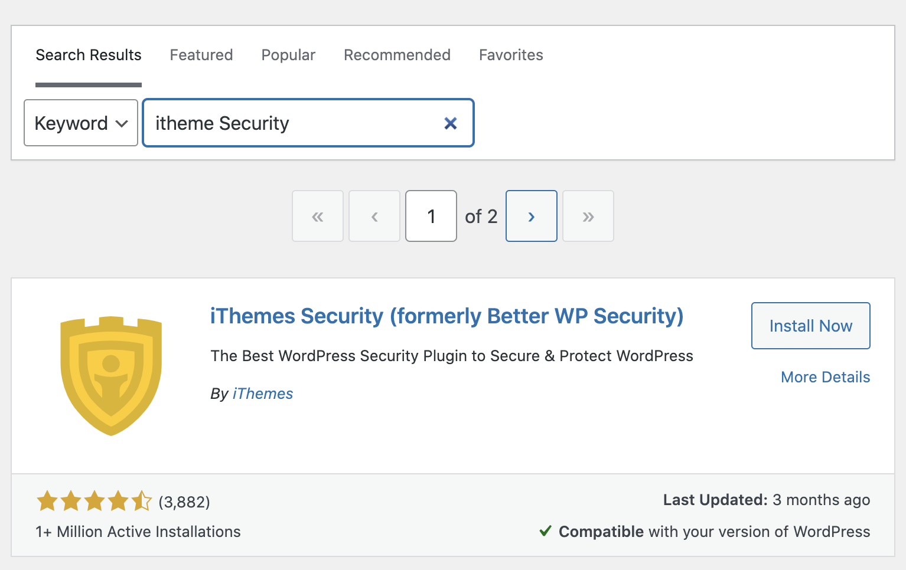

# Step 4 - Imporve WordPress Security

WordPress is a software for people to setup a website, but it may suffer several attack such as Brute force attacks by attacker. It is necessary to Imporve WordPress Security. In this scenario, iThemes Security plugin will be used to improve WordPress Security.

##Install the iThemes Security plugin
- Press Add New on the left of the WordPress menu.

- Type iThemes Security in the search bar.

