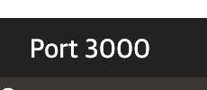
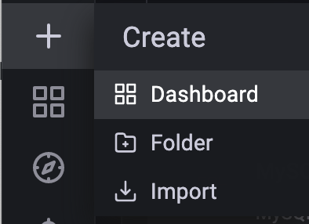
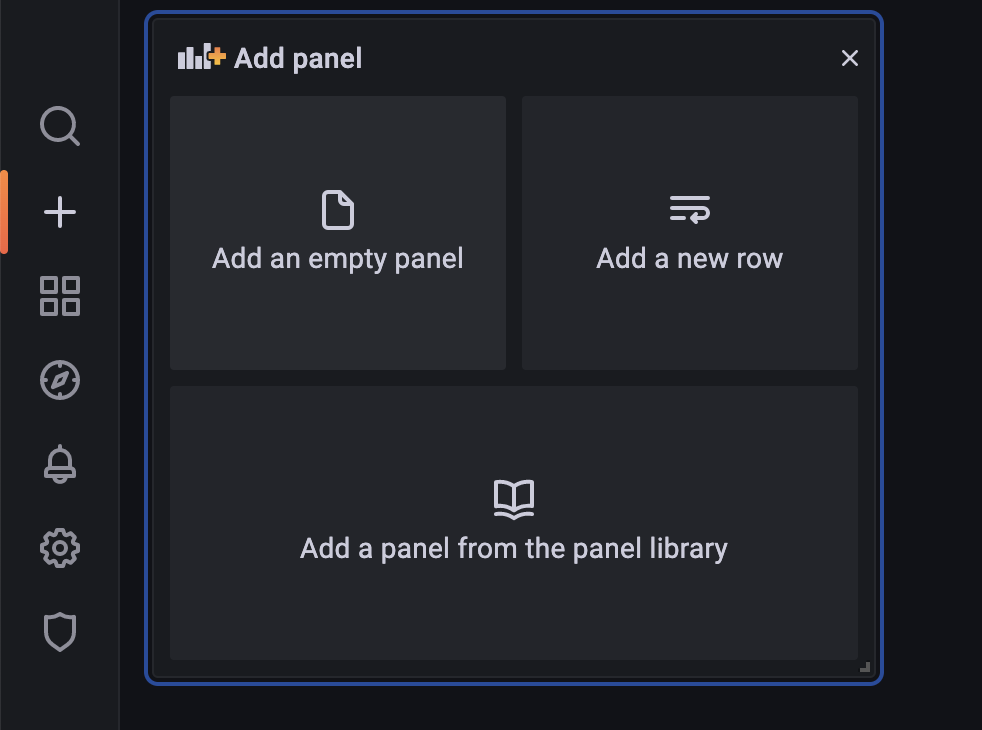
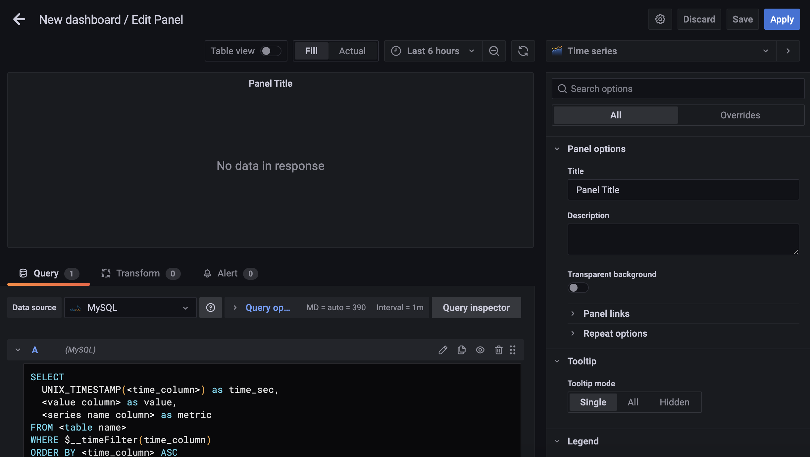

# Step 5 - monitoring the WordPress detail

When WordPress application is running, it will log the event. In this scenario, we will use grafana to visualize the log.

# Grafana
Grafana is an open source visualization and analytics software which allows you to query, visualize, alert on, and explore data and metrics. 

## Preparation
Press the dashboard named "Port 3000". It will lead you to Grafana login page.

Type admin as username and password to login. It is the default identification. You can change it after logging in.

Before you monitor the database, you need to add a data source.
Example:

After you connect the Mysql database, you can press create dashboard
Example:

Click add an empty panel to add a panel
Example:

You can edit your panel by using SQL query and select the panel type in this page.
Example:

