# Step 4 - Improve WordPress Security

WordPress is open-source content management system for people to set up websites, but it may suffer several attacks, such as brute force attacks by attackers. It is necessary to improve WordPress Security. In this scenario, the iThemes Security plugin and Password bcrypt plugin will be used to improve WordPress Security.
# iThemes Security
iThemes Security is a plugin used to secure and protect WordPress. Some functions are limited because of free version. Only functions of free version will be introduced.

## Installation and Setting up the iThemes Security plugin
Press Add New on the left of the WordPress menu.

Type iThemes Security in the search bar and click install now.

After installation, click Activate.
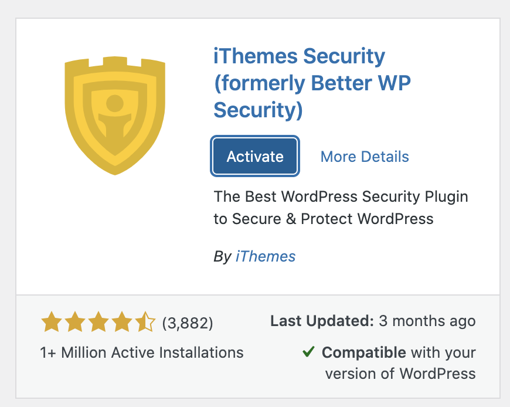

Press Security on the left of the WordPress menu.
Choose ECOMMERCE type to set up the plugin.

In this scenario, choose self and choose the correct role for customers

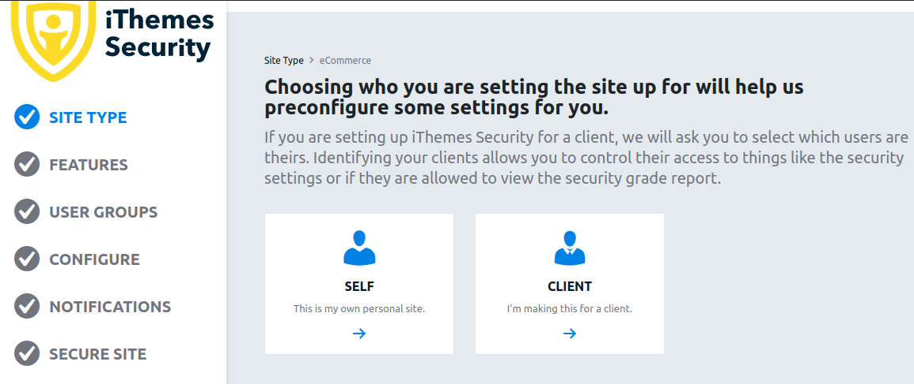
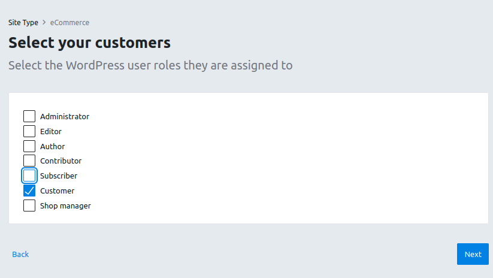

This plugin can force users to use a strong password. As mentioned in step 2, it analyzes patterns in the password to prevent dictionary attack.

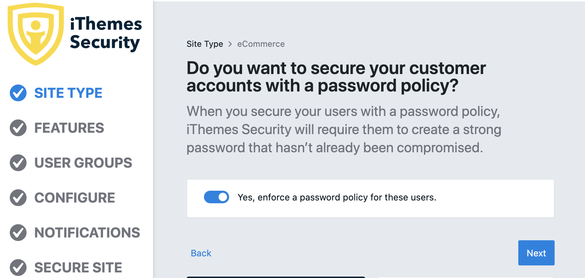

In Login Security, you can enable Two-Factor features to make your WordPress user accounts more secure.

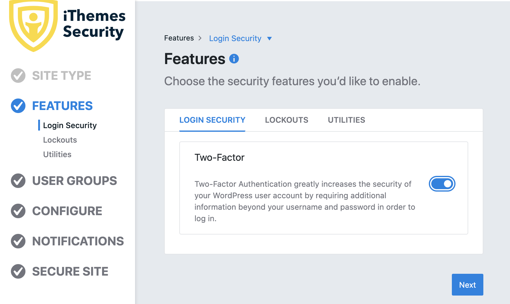

Free version of iThemes can allow the website to prevent LOCAL brute force attacks.

Local Brute Force and Network Brute Force:

Both enabled:

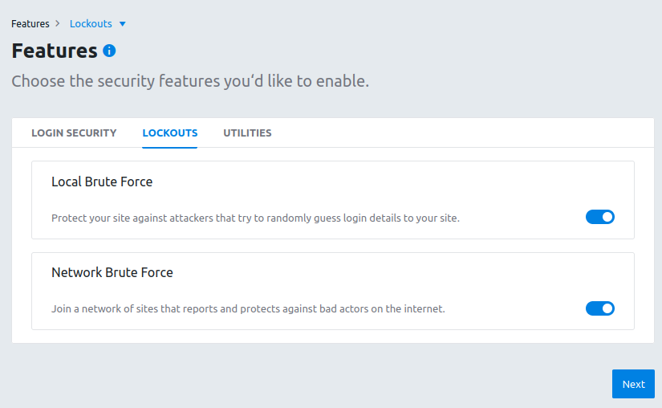

You can double check your secure setting by this overview page.

After finishing the configuration, click Secure Site to complete the setup.

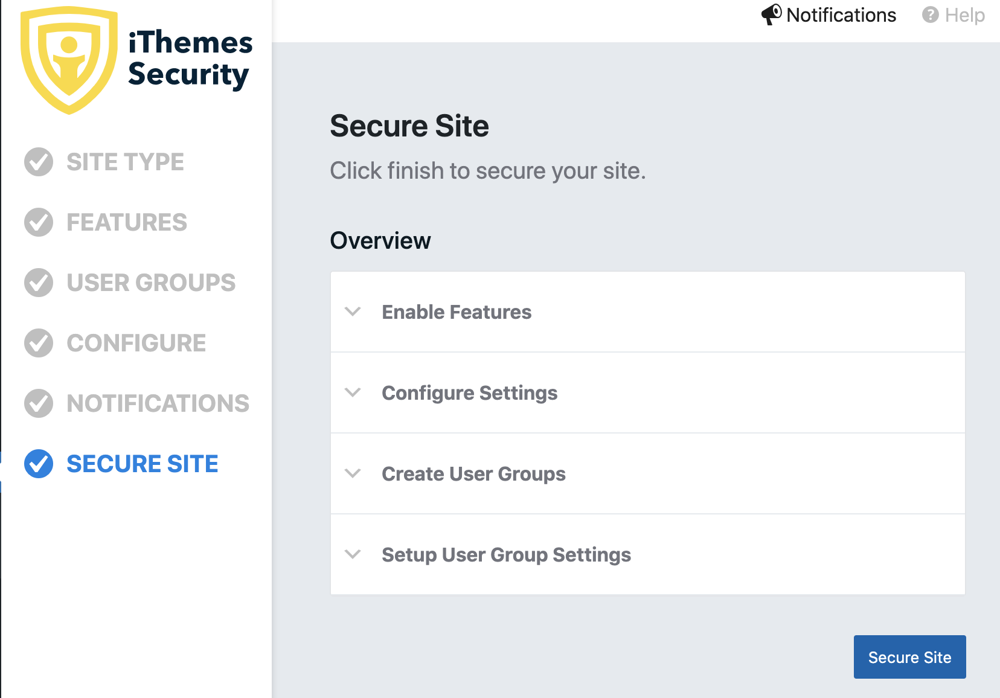

You can view the dashboard here:

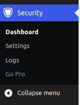

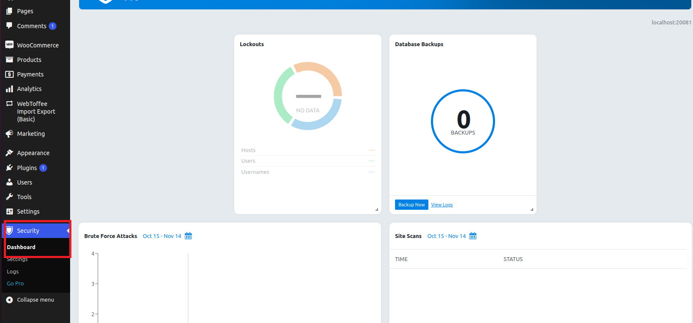

## Verify itheme Security features
When users try to login to WordPress, user can set up two-factor authentication to protect their accounts.

Include mobile app, email and backup codes:

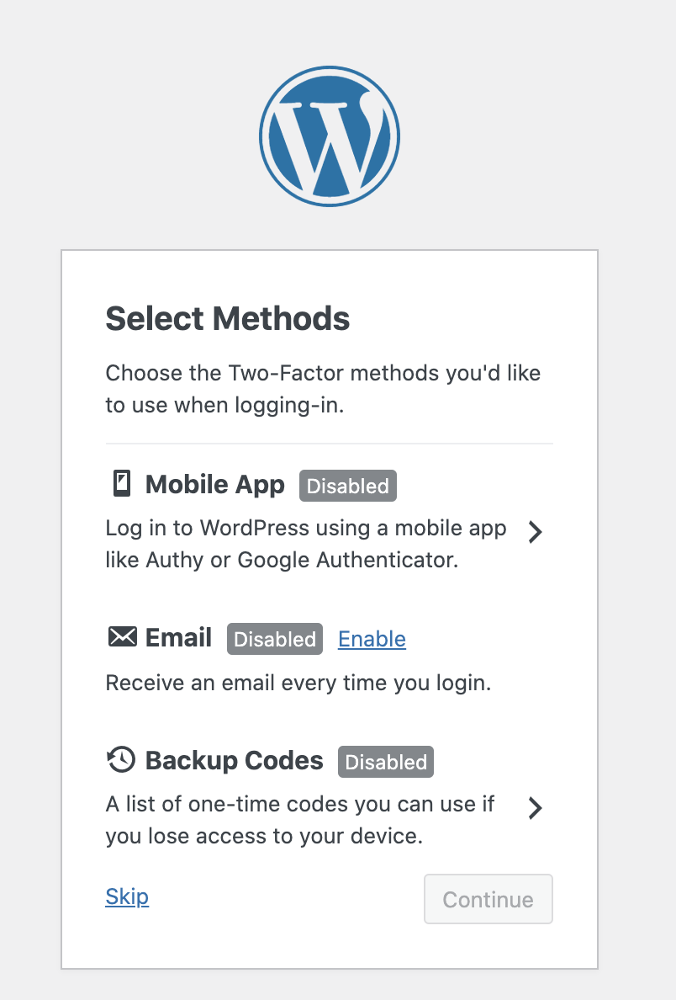

The mobile app choice will generate QR code. After users scan the QR code, enter the authentication code.

Example:

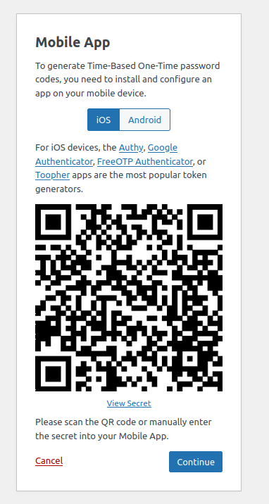

If the users' password is weak, It will force the user to change a strong password.

## Prevent Unauthorized Login 

When an attacker performs brute force attack on your WordPress site, iThemes Security can detect and log it.

Looking from hacker perspective:

wordlist contains administrator password for demonstration:

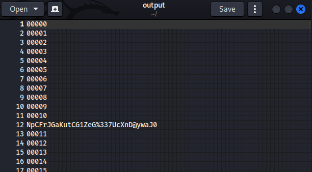

Brute force process:

The screenshot shown here shows that `Error: Unknown response received Code: 403`. The plugin successfully protected the website.

In the dashboard

Example:

You can also configure the login attempts to reduce risk. Using admin as username is not a good security practice. As a hacker perpective, username "admin" is too obvious and let hackers easy to guess it. It will greatly increase the chance of hackers to attack your website.
iThemes security allow you to automatically ban "admin" user and limit max login attempts. 

Press gear icon in the Lockouts page:

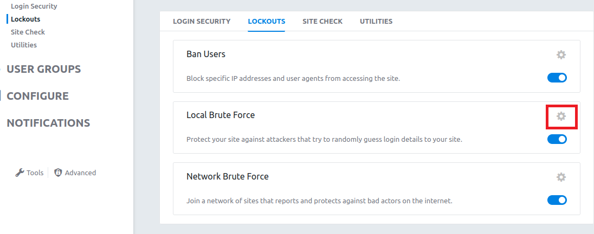

It will lead to this page:

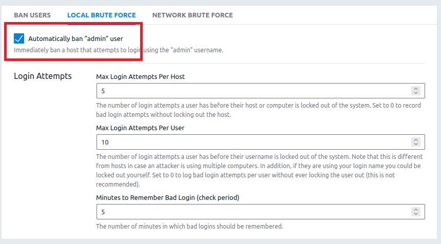

It is possible to add users into ban list in the Lockouts page also. Default ban list is not recommended. It is very old and no longer supported. 

Example:

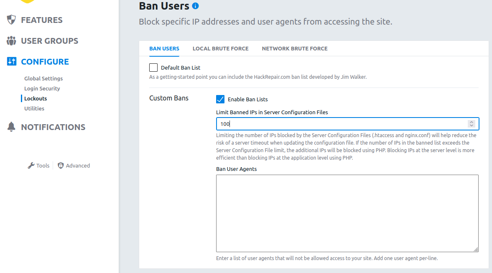

# Password bcrypt
Password bcrypt is a WordPress plugin to replace WordPress's outdated and insecure MD5-based password hashing with a modern and more secure encryption method, bcrypt.

## Installation
Type Password bcrypt in the search bar and click install now.
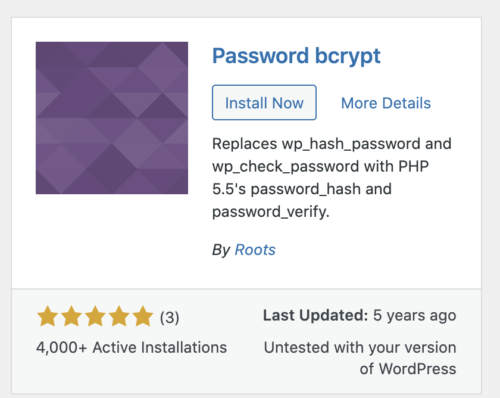

After installation and clicking Activate, the plugin will encrypt the password immediately.

 
Alternatively, download "wp-password-bcrypt.php" file from the plugin's github site.
Create folder "mu-plugins" in wp-content folder and copy the php file downloaded in the folder.

The plugin will becomes must-use plugin in WordPress, which can also encrypt the password.

