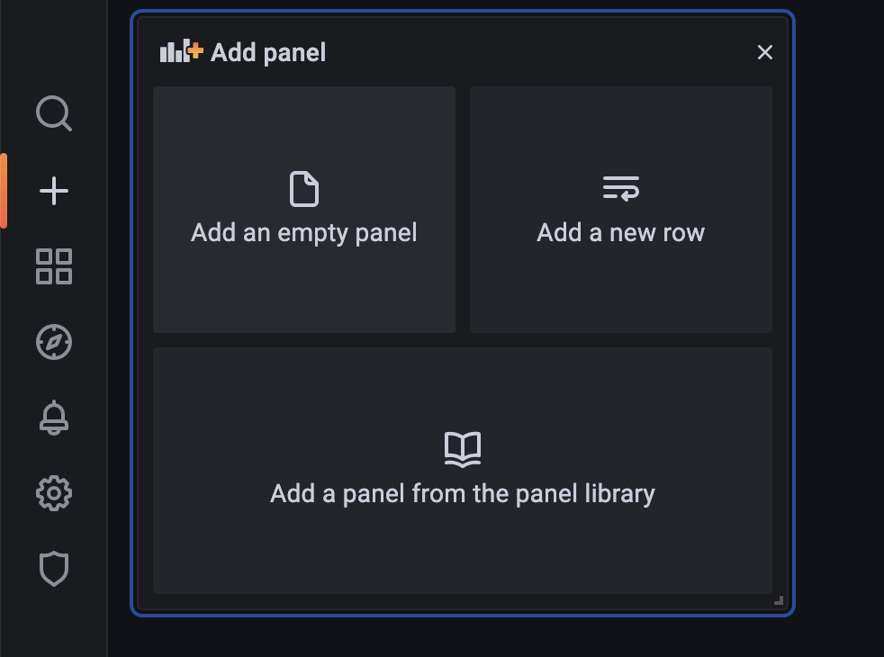
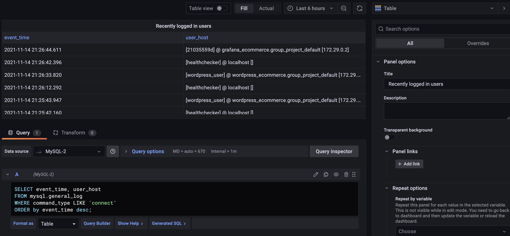
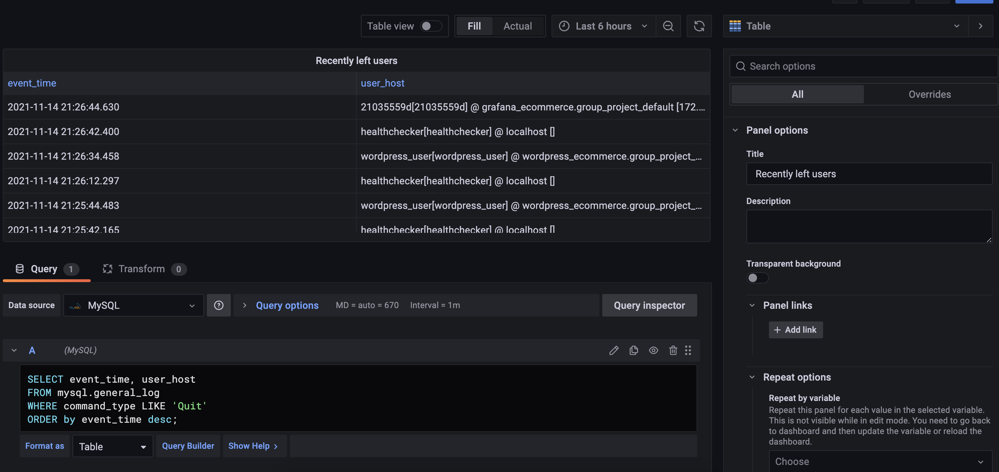
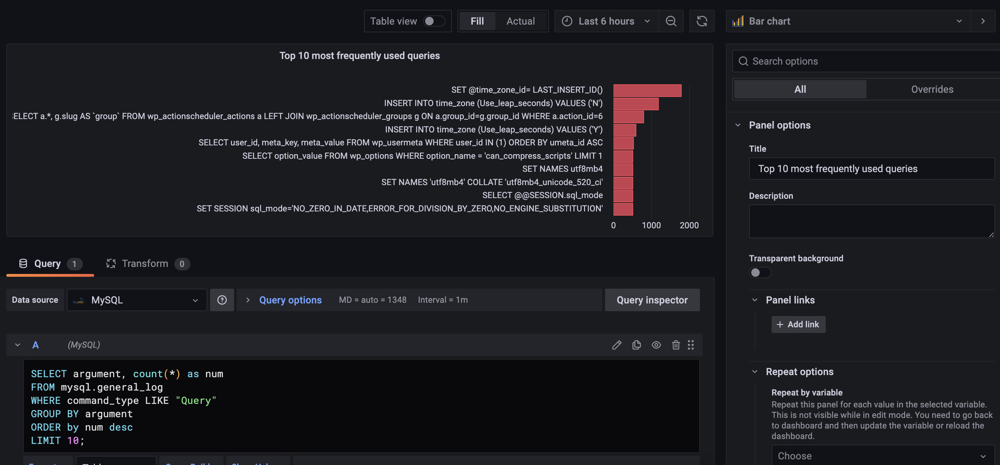
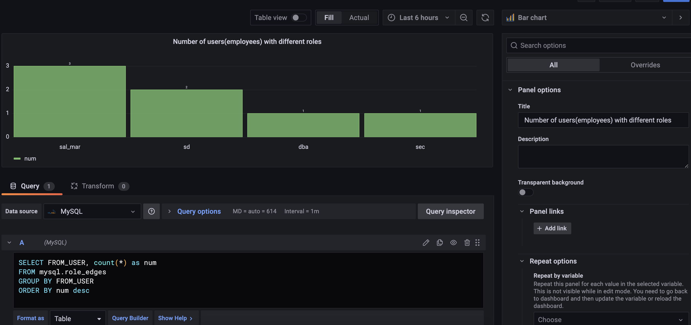
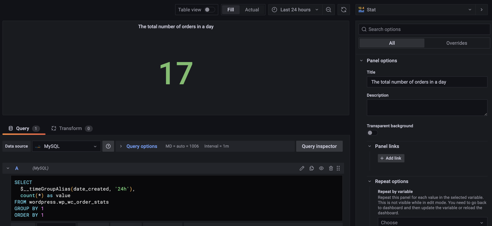
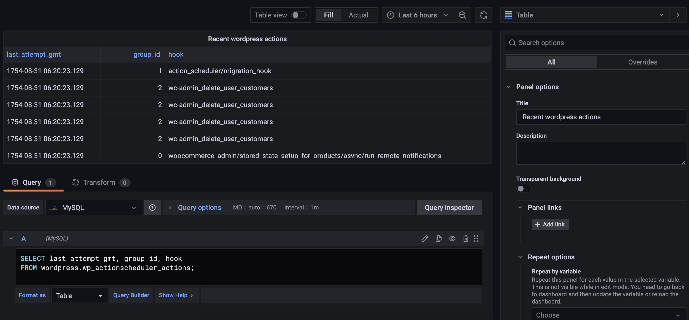

# Step 6 - Monitoring the WordPress

When WordPress application is running, it will log the event. In this scenario, we will use grafana to visualize the log.

# Grafana
Grafana is an open source visualization and analytics software which allows you to query, visualize, alert on, and explore data and metrics. 

## Preparation
Press the dashboard named "Port 3000". It will lead you to Grafana login page.

Type admin as username and password to login. It is the default identification. You can change it after logging in.

Before you monitor the database, you need to add a data source.
Path to add data source: configuration -> data sources -> choose mysql -> type the information.
Example:

After you connect the Mysql database, you can press create dashboard
Example:

Click add an empty panel to add a panel
Example:

You can edit your panel by using SQL query and select the panel type in this page.
Example:

## Panels for monitoring WordPress 
### Recently logged in users(Table)
copy the SQL
<pre class="file">
SELECT event_time, user_host
FROM mysql.general_log
WHERE command_type LIKE 'connect'
ORDER by event_time desc;
</pre>

### Recently left in users(Table)
copy the SQL
<pre class="file">
SELECT event_time, user_host
FROM mysql.general_log
WHERE command_type LIKE 'Quit'
ORDER by event_time desc;
</pre>

### Top 10 most frequently used queries (bar chart horizontal)
copy the SQL
<pre class="file">
SELECT argument, count(*) as num
FROM mysql.general_log
WHERE command_type LIKE "Query"
GROUP BY argument
ORDER by num desc
LIMIT 10;
</pre>

### Number of users(employees) with different roles (bar chart vertical)
copy the SQL
<pre class="file">
SELECT FROM_USER, count(*) as num
FROM mysql.role_edges
GROUP BY FROM_USER
ORDER BY num desc
</pre>

### The total number of orders in a day (stat)
copy the SQL
<pre class="file">
SELECT
  $__timeGroupAlias(date_created, '24h'),
  count(*) as value
FROM wordpress.wp_wc_order_stats
GROUP BY 1
ORDER BY 1
</pre>

### Recent wordpress actions (table)
copy the SQL
<pre class="file">
SELECT last_attempt_gmt, group_id, hook
FROM wordpress.wp_actionscheduler_actions;
</pre>

### Number of posts per hour (time series bar horizontal)
copy the SQL
<pre class="file">
SELECT
  $__timeGroupAlias(post_date, '1h'),
  count(*) as value
FROM wordpress.wp_posts
GROUP BY 1
ORDER BY 1
</pre>

### Number of comments per hour (time series bar horizontal)
copy the SQL
<pre class="file">
SELECT
  $__timeGroupAlias(comment_date, '1h'),
  count(*) as value
FROM wordpress.wp_comments
GROUP BY 1
ORDER BY 1
</pre>

